# HyperAgents - Self-Improving AI Agent Framework

> **更新时间**: 2026-03-30 11:34:52
>
> **项目类型**: AI Research / Multi-Agent Reinforcement Learning
>
> **主要语言**: Python 3.12+

---

## 项目愿景

HyperAgents 是一个**自引用自我改进的 AI 智能体框架**，能够通过递归自我优化来改进任何可计算的任务。该项目由 Meta Research 团队开发，实现了智能体在不同领域（游戏、机器人控制、代码生成、数学证明等）中的自动改进和进化。

**核心创新**：
- **Meta-Agent**: 递归式自我改进，通过分析自身代码和评估结果来生成改进方案
- **Task-Agent**: 在特定领域执行任务的基础智能体
- **多领域支持**: 从强化学习游戏到机器人控制，从代码生成到数学证明
- **自动化进化循环**: 评估 → 选择父代 → Meta改进 → 评估新代

---

## 架构总览

### 核心工作流程

```
初始化智能体 → 领域评估 → 选择最佳父代 → Meta-Agent生成改进 → 应用差异 → 新一代评估 → 循环
```

**关键组件**：

1. **Agent Framework** (`agent/`)
   - `AgentSystem`: 所有智能体的抽象基类
   - `MetaAgent`: 递归式自我改进智能体
   - `TaskAgent`: 任务执行智能体
   - LLM 集成：支持 OpenAI GPT-4/5、Anthropic Claude、Google Gemini

2. **Domain System** (`domains/`)
   - 每个领域独立的评估器、环境和数据集
   - 统一的评估接口（`harness.py`, `evaluator.py`）
   - 领域特定的评分指标

3. **Genetic Loop** (`generate_loop.py`)
   - 管理整个进化过程
   - Docker 容器化执行
   - 档案管理和可视化

---

## ✨ 模块结构图

```mermaid
graph TD
    A["(根) HyperAgents"] --> B["agent/ - 核心智能体框架"];
    A --> C["domains/ - 领域实现"];
    A --> D["baselines/ - 基线实现"];
    A --> E["analysis/ - 分析工具"];
    A --> F["utils/ - 通用工具"];

    B --> B1["base_agent.py"];
    B --> B2["meta_agent.py"];
    B --> B3["task_agent.py"];
    B --> B4["llm.py"];
    B --> B5["tools/"];

    C --> C1["balrog/ - 游戏RL"];
    C --> C2["genesis/ - 机器人控制"];
    C --> C3["polyglot/ - 代码生成"];
    C --> C4["imo/ - 数学证明"];
    C --> C5["search_arena/ - 搜索评估"];
    C --> C6["paper_review/ - 论文评审"];

    C1 --> C1A["environments/"];
    C1 --> C1B["evaluator.py"];
    C1 --> C1C["dataset.py"];

    C2 --> C2A["environments/"];
    C2 --> C2B["genesis_eval/"];
    C2 --> C2C["genesis_train/"];

    D --> D1["ai_reviewer/"];
    D --> D2["dgm/"];
    D --> D3["sft_openai/"];
    D --> D4["imo_proof/"];
    D --> D5["genesis_go2walking/"];

    E --> E1["plot_progress.py"];
    E --> E2["visualize_archive.py"];
    E --> E3["plot_comparison.py"];

    F --> F1["docker_utils.py"];
    F --> F2["gl_utils.py"];
    F --> F3["domain_utils.py"];
    F --> F4["git_utils.py"];

    click B "./agent/CLAUDE.md" "查看 agent 模块文档"
    click C "./domains/CLAUDE.md" "查看 domains 模块文档"
    click C1 "./domains/balrog/CLAUDE.md" "查看 balrog 模块文档"
    click C2 "./domains/genesis/CLAUDE.md" "查看 genesis 模块文档"
    click C3 "./domains/polyglot/CLAUDE.md" "查看 polyglot 模块文档"
    click C4 "./domains/imo/CLAUDE.md" "查看 IMO 模块文档"
    click C5 "./domains/search_arena/CLAUDE.md" "查看 search_arena 模块文档"
    click C6 "./domains/paper_review/CLAUDE.md" "查看 paper_review 模块文档"
    click D "./baselines/CLAUDE.md" "查看 baselines 模块文档"
    click E "./analysis/CLAUDE.md" "查看 analysis 模块文档"
    click F "./utils/CLAUDE.md" "查看 utils 模块文档"
```



---

## 模块索引

| 模块路径 | 职责 | 主要技术 | 文档状态 |
|---------|------|---------|----------|
| **agent/** | 核心智能体抽象与LLM集成 | Python, LiteLLM | ✅ 已创建 |
| **domains/balrog/** | 游戏强化学习环境 | Gym, Gymnasium, NLE | ✅ 已创建 |
| **domains/genesis/** | 机器人控制仿真 | Genesis, RSL-RL, PyTorch | ✅ 已创建 |
| **domains/polyglot/** | 代码生成基准测试 | Docker, Git, Python | ✅ 已创建 |
| **domains/imo/** | 数学证明生成与评分 | Sympy, ProofGrader | ✅ 已创建 |
| **domains/search_arena/** | 搜索能力评估 | Python, HuggingFace Datasets | ✅ 已创建 |
| **domains/paper_review/** | 论文评审 | Python, Pandas | ✅ 已创建 |
| **baselines/** | 各领域基线实现 | 多样化 | ✅ 已创建 |
| **analysis/** | 结果可视化与分析 | Matplotlib, Pandas, NetworkX | ✅ 已创建 |
| **utils/** | 通用工具库 | Docker, Git, JSON | ✅ 已创建 |

---

## 运行与开发

### 环境要求

**系统依赖**:
```bash
# Fedora/CentOS
sudo dnf install -y python3.12-devel graphviz graphviz-devel cmake ninja-build bzip2-devel zlib-devel ncurses-devel libffi-devel

# Ubuntu/Debian
sudo apt-get install -y python3.12-dev graphviz cmake ninja-build bzip2 zlib1g-dev libncurses-dev libffi-dev
```

**Python 版本**: 3.12+

### 快速启动

1. **配置 API 密钥** (`.env` 文件):
```bash
OPENAI_API_KEY=sk-...
ANTHROPIC_API_KEY=sk-ant-...
GEMINI_API_KEY=...
```

2. **安装依赖**:
```bash
python3.12 -m venv venv_nat
source venv_nat/bin/activate
pip install -r requirements.txt
pip install -r requirements_dev.txt
```

3. **构建 Docker 容器** (可选但推荐):
```bash
docker build --network=host -t hyperagents .
```

4. **运行初始化智能体**:
```bash
bash ./setup_initial.sh
```

5. **启动进化循环**:
```bash
# 示例：在 Balrog 游戏域运行
python generate_loop.py --domains balrog_minihack

# 示例：在 Genesis 机器人域运行
python generate_loop.py --domains genesis_go2walking

# 示例：在 Polyglot 代码生成域运行
python generate_loop.py --domains polyglot
```

### 输出目录结构

```
outputs/
├── {run_id}/
│   ├── eval.log                    # 评估日志
│   ├── archive.json                # 进化档案
│   ├── chat_history.md             # 对话历史
│   ├── {domain_name}/              # 领域特定结果
│   │   ├── episode_0/              # 单个episode结果
│   │   │   ├── chat_history.md
│   │   │   ├── prediction.json
│   │   │   └── metrics.json
│   └── ...
```

---

## 测试策略

### 单元测试
- **位置**: 未发现标准 `tests/` 目录
- **建议**: 需要为关键模块添加单元测试
  - `agent/` 模块的 LLM 集成测试
  - `utils/` 模块的工具函数测试
  - 领域特定的环境测试

### 集成测试
- **方式**: 通过 `generate_loop.py` 的端到端运行
- **覆盖**:
  - Docker 容器内的完整执行流程
  - 领域评估器的正确性
  - Meta-Agent 的改进循环

### 评估基准
每个领域有自己的评估标准：

| 领域 | 评估指标 | 评估脚本 |
|-----|---------|---------|
| **Balrog** | `average_progress` (游戏进度) | `python -m domains.harness --domain balrog_*` |
| **Genesis** | `average_fitness` (机器人适应度) | `python -m domains.harness --domain genesis_*` |
| **Polyglot** | `accuracy_score` (代码生成准确率) | `python -m domains.polyglot.run_evaluation` |
| **IMO Proof** | `points_percentage` (证明得分百分比) | `python -m domains.harness --domain imo_proof` |
| **Search Arena** | `overall_accuracy` (搜索准确率) | `python -m domains.harness --domain search_arena` |
| **Paper Review** | `overall_accuracy` (评审准确率) | `python -m domains.harness --domain paper_review` |

### 质量保证
- **Docker 隔离**: 所有代码执行在容器中进行，防止副作用
- **错误处理**: LLM 调用使用 `backoff` 库进行重试
- **日志记录**: 所有对话和评估结果记录到 Markdown 文件

---

## 编码规范

### Python 代码风格
- **版本**: Python 3.12+
- **格式化**: 未发现明确的 `black`/`ruff` 配置
- **类型提示**: 部分使用（建议增强）
- **文档字符串**: 基本存在，建议完善为 Google/Numpy 风格

### 项目约定
1. **模块导入**: 相对导入用于模块内部，绝对导入用于跨模块
2. **配置管理**: 使用 OmegaConf (`@hydra.main`) 在 Balrog/Genesis 领域
3. **日志记录**: 使用 `ThreadLoggerManager` 支持多线程日志
4. **错误处理**: 关键路径使用 try-except，记录失败但继续执行

### 命名约定
- **类名**: `PascalCase` (如 `MetaAgent`, `EvaluatorManager`)
- **函数/方法**: `snake_case` (如 `get_domain_score_key`)
- **常量**: `UPPER_SNAKE_CASE` (如 `OPENAI_MODEL`, `MAX_TOKENS`)
- **私有方法**: 前缀下划线 (如 `_internal_method`)

---

## AI 使用指引

### 项目结构理解
1. **从入口点开始**: 阅读 `generate_loop.py` 理解整体流程
2. **领域抽象**: `domains/harness.py` 定义了统一的领域接口
3. **智能体系统**: `agent/base_agent.py` 是所有智能体的基类

### 关键设计模式

**1. 智能体模式**:
```python
class MetaAgent(AgentSystem):
    def forward(self, repo_path, eval_path, iterations_left):
        # 自我改进逻辑
        instruction = f"Modify any part of the codebase at `{repo_path}`."
        new_msg_history = chat_with_agent(instruction, model=self.model, ...)
```

**2. 领域模式**:
每个领域实现统一接口：
- `eval.py`: 评估逻辑
- `evaluator.py`: 评估器管理
- `harness.py`: 测试工具

**3. Docker 隔离模式**:
所有代码执行在容器中进行：
```python
from utils.docker_utils import build_container, run_in_container
```

### 常见任务

**添加新领域**:
1. 在 `domains/` 下创建新目录
2. 实现 `eval.py`, `evaluator.py`, `harness.py`
3. 在 `utils/domain_utils.py` 中注册领域
4. 更新 `generate_loop.py` 的参数解析

**调试 Meta-Agent 改进**:
1. 检查 `outputs/{run_id}/chat_history.md`
2. 查看应用的差异：`outputs/{run_id}/diffs/`
3. 分析档案：`outputs/{run_id}/archive.json`

**运行特定评估**:
```bash
# 单个领域评估
python -m domains.harness --domain <domain_name> --run_id <run_id> --num_samples 10

# 生成报告
python -m domains.report --domain <domain_name> --dname ./outputs/<run_id>
```

### 依赖关系
```
generate_loop.py
    ├── utils/gl_utils.py (遗传循环逻辑)
    ├── utils/docker_utils.py (容器管理)
    ├── domains/harness.py (领域评估)
    │   ├── domains/*/eval.py (领域特定评估)
    │   └── domains/*/evaluator.py (评估器)
    ├── meta_agent.py (Meta智能体)
    └── task_agent.py (Task智能体)
        ├── agent/llm.py (LLM接口)
        └── agent/tools/ (工具集)
```

---

## 安全考虑

> ⚠️ **警告**: 此项目涉及执行不受信任的模型生成代码。

**风险**:
- 模型生成的代码可能包含恶意行为
- 代码可能由于能力限制而具有破坏性
- LLM 对齐不完美可能导致意外行为

**缓解措施**:
- Docker 容器隔离所有代码执行
- 网络限制（容器内无外网访问）
- 资源限制（CPU、内存、时间限制）
- 用户明确了解并接受风险

---

## 扩展阅读

**论文**:
- arXiv: [2603.19461](https://arxiv.org/abs/2603.19461)
- Meta Research Blog: [HyperAgents](https://ai.meta.com/research/publications/hyperagents/)

**相关项目**:
- [Balrog AI](https://github.com/balrog-ai/) - 游戏AI评估基准
- [Genesis](https://github.com/Genesis-Embodied-AI/) - 机器人仿真平台
- [Polyglot](https://github.com/MoonRide303/polyglot) - 代码生成基准

---

## 变更记录 (Changelog)

### 2026-03-30 11:34:52 - 增量更新完成 🎉
- ✅ 创建 search_arena 模块文档
- ✅ 创建 paper_review 模块文档
- ✅ 创建 baselines 模块文档
- ✅ 创建 analysis 模块文档
- ✅ 创建 utils 模块文档
- ✅ 更新根级 CLAUDE.md 模块索引
- ✅ 更新 Mermaid 结构图链接
- 📊 模块覆盖率: 100% (10/10 模块已完成)

### 2026-03-30 11:14:03 - 初始化文档
- ✅ 创建根级 CLAUDE.md
- ✅ 识别 10 个主要模块
- ✅ 生成 Mermaid 结构图
- ✅ 记录运行与开发指南
- 📊 扫描覆盖率: ~85% (150+ Python 文件)
- 📝 模块文档: agent/, domains/*, baselines/, analysis/, utils/

---

*本文档由 PAI Architecture Agent 自动生成和维护*
