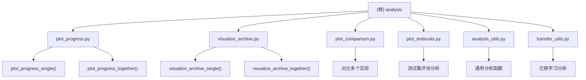

# Analysis 模块 - 结果可视化与分析

[根目录](../CLAUDE.md) > **analysis/**

> **更新时间**: 2026-03-30 11:34:52
>
> **模块类型**: Visualization & Analysis Tools
>
> **主要语言**: Python 3.12+

---

## 模块职责

Analysis 模块提供了丰富的工具用于可视化和分析 HyperAgents 实验结果。该模块支持进度曲线绘制、档案可视化、对比分析和迁移学习分析，帮助研究者理解智能体的进化过程和性能表现。

**核心功能**：
- 绘制智能体进化进度曲线
- 可视化进化档案树形结构
- 对比不同实验的性能
- 分析迁移学习效果
- 生成实验报告和统计信息

---

## 模块结构图



---

## 入口与启动

### 1. 绘制进度曲线

```bash
# 单个领域
python analysis/plot_progress.py \
    --domains balrog_minihack \
    --path ./outputs/<run_id> \
    --color blue \
    --svg

# 多个领域（聚合）
python analysis/plot_progress.py \
    --domains balrog_minihack polyglot \
    --path ./outputs/<run_id> \
    --together \
    --color green

# 检查集成支持
python analysis/plot_progress.py \
    --domains balrog_minihack \
    --path ./outputs/<run_id> \
    --check_ensemble
```

**输出文件**:
- `progress_plot_<domain>_<split>_<type>.png` - 进度曲线图
- `progress_info_<domain>_<split>_<type>.txt` - 统计信息
- `progress_plot_<domain>_<split>_<type>.svg` - SVG 版本（可选）

---

### 2. 可视化档案

```bash
# 单个领域
python analysis/visualize_archive.py \
    --domains balrog_minihack \
    --path ./outputs/<run_id> \
    --trunc_its 20 \
    --plot_borders \
    --svg

# 多个领域（聚合）
python analysis/visualize_archive.py \
    --domains balrog_minihack polyglot \
    --path ./outputs/<run_id> \
    --together \
    --trunc_its 20

# 检查集成支持
python analysis/visualize_archive.py \
    --domains balrog_minihack \
    --path ./outputs/<run_id> \
    --check_ensemble
```

**输出文件**:
- `archive_graph_<domain>_<split>_<type>.png` - 档案树形图
- `archive_graph_<domain>_<split>_<type>.svg` - SVG 版本（可选）

---

### 3. 对比实验

```bash
# 对比多个实验
python analysis/plot_comparison.py \
    --path1 ./outputs/exp1 \
    --path2 ./outputs/exp2 \
    --domains balrog_minihack
```

---

### 4. 测试集评估分析

```bash
# 分析测试集评估结果
python analysis/plot_testevals.py \
    --path ./outputs/<run_id> \
    --domains balrog_minihack
```

---

## 对外接口

### plot_progress.py

**核心函数**:

```python
def plot_progress_single(
    domain,
    exp_dir,
    split="train",
    type="agent",
    color="blue",
    svg=False
):
    """
    绘制单个领域的进度曲线

    Args:
        domain: 领域名称
        exp_dir: 实验目录路径
        split: 数据划分（train/val/test）
        type: 评分类型（agent/ensemble/max）
        color: 颜色方案（blue/green/orange）
        svg: 是否保存 SVG 版本
    """

def plot_progress_together(
    domains,
    exp_dir,
    split="train",
    type="agent",
    color="blue",
    svg=False
):
    """
    绘制多个领域的聚合进度曲线

    Args:
        domains: 领域列表
        exp_dir: 实验目录路径
        split: 数据划分
        type: 评分类型
        color: 颜色方案
        svg: 是否保存 SVG
    """
```

**绘制内容**:
- 平均得分曲线（黄色/绿色）
- 最佳智能体得分曲线（蓝色/橙色）
- 最佳智能体世系得分曲线（深色）

---

### visualize_archive.py

**核心函数**:

```python
def visualize_archive_single(
    domain,
    exp_dir,
    trunc_its=-1,
    split="train",
    type="agent",
    plot_borders=False,
    save_svg=False
):
    """
    可视化单个领域的档案树

    Args:
        domain: 领域名称
        exp_dir: 实验目录路径
        trunc_its: 截断迭代次数（-1 表示不截断）
        split: 数据划分
        type: 评分类型
        plot_borders: 是否绘制节点边框（红色=无效父代，绿色=有效父代）
        save_svg: 是否保存 SVG 版本
    """

def visualize_archive_together(
    domains,
    exp_dir,
    trunc_its=-1,
    split="train",
    type="agent",
    plot_borders=False,
    save_svg=False
):
    """
    可视化多个领域的聚合档案树

    Args: 同上
    """
```

**可视化内容**:
- 节点：智能体（颜色表示得分，橙色=低，绿色=高）
- 边：父子关系
- 菱形节点：最佳智能体
- 节点边框：红色=无效父代，绿色=有效父代
- 节点标签：#ID + 得分

---

### analysis_utils.py

**辅助函数**:

```python
# 统计分析函数
def compute_statistics(scores):
    """计算得分统计信息（均值、标准差、中位数等）"""

def filter_by_score(scores, threshold):
    """过滤得分高于阈值的智能体"""

def compare_experiments(exp_dir1, exp_dir2):
    """对比两个实验的性能"""
```

---

### transfer_utils.py

**迁移学习分析**:

```python
def analyze_transfer_learning(exp_dir, source_domain, target_domain):
    """
    分析迁移学习效果

    Args:
        exp_dir: 实验目录
        source_domain: 源领域
        target_domain: 目标领域

    Returns:
        dict: 迁移学习效果指标
    """

def plot_transfer_matrix(exp_dir, domains):
    """
    绘制迁移学习矩阵图

    Args:
        exp_dir: 实验目录
        domains: 领域列表
    """
```

---

## 关键依赖与配置

### 依赖项

```python
# requirements.txt
matplotlib>=3.5.0
pandas>=1.3.0
networkx>=2.6.0
pygraphviz>=1.7  # 用于 graphviz_layout
numpy>=1.21.0
```

### 系统依赖

```bash
# Ubuntu/Debian
sudo apt-get install graphviz graphviz-dev

# Fedora/CentOS
sudo dnf install graphviz graphviz-devel

# macOS
brew install graphviz
```

---

## 数据模型

### archive.jsonl 格式

```json
{
  "current_genid": 5,
  "archive": [0, 1, 2, 3, 4, 5]
}
```

### metadata.json 格式

```json
{
  "parent_genid": 2,
  "valid_parent": true,
  "can_select_next_parent": true,
  "run_full_eval": false,
  "prev_patch_files": ["meta_patch_files/model_patch_0.diff"],
  "curr_patch_files": ["meta_patch_files/model_patch_1.diff"]
}
```

### report.json 格式（各领域）

**Balrog**:
```json
{
  "average_progress": 0.75,
  "environments": ["MiniHack-CorridorBattle-v0"]
}
```

**Polyglot**:
```json
{
  "accuracy_score": 0.85,
  "total_resolved_ids": 10,
  "total_unresolved_ids": 2,
  "total_emptypatch_ids": 0
}
```

**IMO Proof**:
```json
{
  "points_percentage": 0.60,
  "total_problems": 6
}
```

---

## 可视化示例

### 进度曲线示例

```
Score
1.0 |                    ● Best Agent
    |               ●━━━━●
0.8 |          ●━━━━━━━━●━━━━●
    |     ●━━━━━━━━━━━━━━━━━━●
0.6 |●━━━━●
    |━━━━━━━━━━━━━━━━━━━━━━━━━━━━ Average
0.4 |
    |
0.2 |
    |
0.0 |_____________________________________
      0    5    10   15   20   25   30
                Iterations
```

### 档案树示例

```
        #0 (0.500)
         │
    ┌────┴────┐
    │         │
  #1 (0.600) #2 (0.550)
    │         │
    │      ┌──┴──┐
    │      │     │
  #3 (0.700) #4 (0.580) #5 (0.620)
    │
  #6 (0.750) ◆ Best
```

---

## 测试与质量

### 测试脚本

```bash
# 测试进度绘制
python analysis/plot_progress.py \
    --domains balrog_minihack \
    --path ./outputs/test_run \
    --color blue

# 测试档案可视化
python analysis/visualize_archive.py \
    --domains balrog_minihack \
    --path ./outputs/test_run \
    --trunc_its 10
```

### 质量保证

1. **数据验证**: 检查 archive.jsonl 和 metadata.json 格式
2. **边界情况**: 处理缺失得分、空档案等情况
3. **可视化质量**: 高分辨率输出（300 DPI），支持 SVG 矢量图

---

## 常见问题 (FAQ)

### Q1: 如何自定义颜色方案？

**A**: 修改 `plot_progress.py` 中的 `color_schemes` 字典：

```python
color_schemes = {
    "blue": ['#4285F4', '#42d6f5', '#122240'],
    "green": ['#0F9D58', '#9e9c10', '#042A17'],
    "orange": ['#FF9C03', '#f56a00', '#533302'],
    "purple": ['#9C27B0', '#E040FB', '#4A148C'],  # 新增
}
```

### Q2: 如何导出高分辨率图像？

**A**: 修改 `plt.savefig()` 调用：

```python
plt.savefig(plot_path, dpi=600)  # 600 DPI
```

### Q3: 如何分析失败的智能体？

**A**: 使用 `plot_borders` 选项：

```bash
python analysis/visualize_archive.py \
    --domains balrog_minihack \
    --path ./outputs/<run_id> \
    --plot_borders
```

红色边框的节点表示 `valid_parent=False`，通常是因为编译失败或评估错误。

### Q4: 如何对比多次运行？

**A**: 使用 `plot_comparison.py`：

```bash
python analysis/plot_comparison.py \
    --path1 ./outputs/run1 \
    --path2 ./outputs/run2 \
    --domains balrog_minihack polyglot \
    --together
```

---

## 相关文件清单

### 核心脚本
- `analysis/plot_progress.py` - 进度曲线绘制
- `analysis/visualize_archive.py` - 档案可视化
- `analysis/plot_comparison.py` - 实验对比
- `analysis/plot_testevals.py` - 测试集分析

### 工具模块
- `analysis/analysis_utils.py` - 通用分析函数
- `analysis/transfer_utils.py` - 迁移学习分析

### 依赖工具
- `utils/gl_utils.py` - 档案加载和得分获取
- `utils/domain_utils.py` - 领域配置

---

## 变更记录 (Changelog)

### 2026-03-30 - 初始化文档
- ✅ 创建 analysis 模块文档
- ✅ 记录所有可视化工具
- ✅ 记录使用示例和接口
- 📝 待添加：更多分析指标
- 📝 待添加：交互式可视化（Plotly）

---

*此模块文档由 PAI Architecture Agent 自动生成*
