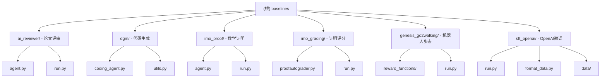

# Baselines 模块 - 基线实现

[根目录](../CLAUDE.md) > **baselines/**

> **更新时间**: 2026-03-30 11:34:52
>
> **模块类型**: Reference Implementations
>
> **主要语言**: Python 3.12+

---

## 模块职责

Baselines 模块包含了各个领域的参考实现和基线智能体，用于与 HyperAgents 框架生成的智能体进行性能对比。这些基线实现代表了不同的方法和策略，从简单的规则系统到复杂的 LLM 驱动代理。

**核心功能**：
- 提供各领域的标准基线实现
- 支持与 HyperAgents 框架的直接对比
- 包含外部研究项目的复现
- 提供 OpenAI SFT 微调基准

---

## 模块结构图



---

## 子模块详解

### 1. AI Reviewer (`ai_reviewer/`)

**职责**: 论文评审基线智能体

**入口**: `baselines/ai_reviewer/run.py`

**运行方式**:
```bash
cd baselines/ai_reviewer
python run.py --run_id <run_id> --num_samples <num_samples>
```

**输出**: `baselines/ai_reviewer/outputs/<run_id>/`

**评估指标**: overall_accuracy

---

### 2. DGM (`dgm/)

**职责**: 代码生成基线（来自 [jennyzzt/dgm](https://github.com/jennyzzt/dgm)）

**入口**: `baselines/dgm/coding_agent.py`

**核心类**:
```python
class CodingAgent:
    def __init__(
        self,
        problem_statement,
        git_tempdir,
        base_commit,
        chat_history_file,
        self_improve=False
    )

    def forward(self):
        """使用 LLM 解决编程问题"""
```

**运行方式**:
```bash
python baselines/dgm/coding_agent.py \
    --problem_statement "..." \
    --git_dir /path/to/repo \
    --base_commit <commit_hash> \
    --chat_history_file ./chat_history.md \
    --outdir /dgm/
```

**特点**:
- 使用 Claude 模型进行代码生成
- 支持自我改进模式（`self_improve=True`）
- 输出代码差异（`model_patch.diff`）

---

### 3. IMO Proof (`imo_proof/`)

**职责**: 数学证明生成基线

**入口**: `baselines/imo_proof/run.py`

**运行方式**:
```bash
cd baselines/imo_proof
python run.py --run_id <run_id> --num_samples <num_samples>
```

**输出**: `baselines/imo_proof/outputs/<run_id>/`

**评估指标**: points_percentage

---

### 4. IMO Grading (`imo_grading/`)

**职责**: 数学证明评分基线（使用 ProofGrader）

**入口**: `baselines/imo_grading/run.py`

**核心组件**:
- `proofautograder.py`: ProofGrader 自动评分系统

**运行方式**:
```bash
cd baselines/imo_grading
python run.py
```

**评估指标**: overall_accuracy

---

### 5. Genesis Go2 Walking (`genesis_go2walking/`)

**职责**: 机器人步态控制基线

**目录结构**:
```
genesis_go2walking/
├── reward_functions/
│   ├── reward_function_00.py
│   ├── reward_function_01.py
│   ├── reward_function_02.py
│   ├── reward_function_03.py
│   └── reward_function_04.py
└── run.py
```

**特点**:
- 包含 5 个不同的奖励函数实现
- 用于 Go2 机器人的步态控制

---

### 6. SFT OpenAI (`sft_openai/`)

**职责**: OpenAI GPT-4o 微调基线

**入口**: `baselines/sft_openai/run.py`

**支持领域**: search_arena, paper_review

**核心功能**:
- 自动上传训练/验证数据到 OpenAI
- 创建和管理微调任务
- 轮询任务状态并记录事件
- 在测试集上评估微调模型
- 支持断点续传（`--resume`）

**运行方式**:
```bash
# 开始新的微调任务
python baselines/sft_openai/run.py --domain search_arena

# 恢复中断的任务
python baselines/sft_openai/run.py \
    --resume baselines/sft_openai/outputs/search_arena_20250914_120000 \
    --domain search_arena

# 自定义轮询间隔
python baselines/sft_openai/run.py \
    --domain paper_review \
    --poll-secs 5

# 强制重新评估
python baselines/sft_openai/run.py \
    --domain search_arena \
    --force-eval
```

**输出结构**:
```
baselines/sft_openai/outputs/<domain>_<timestamp>/
├── job_id.txt                    # 微调任务 ID
├── job_created.json              # 任务创建信息
├── events.jsonl                  # 事件流
├── run.log                       # 运行日志
├── eval_predictions.jsonl        # 测试集预测
├── eval_summary.json             # 评估摘要
└── summary.json                  # 最终摘要
```

**评估指标**:
- exact_match_rate: 完全匹配率
- avg_similarity: 平均相似度
- tool_name_match_rate: 工具名称匹配率
- tool_args_match_rate: 工具参数匹配率
- avg_latency_sec: 平均延迟

**数据文件**:
```
baselines/sft_openai/data/
├── {domain}_filtered_100_train.jsonl
├── {domain}_filtered_100_val.jsonl
└── {domain}_filtered_100_test.jsonl
```

**环境要求**:
```bash
pip install --upgrade openai
export OPENAI_API_KEY=sk-...
```

---

## 入口与启动

### 统一运行接口

所有基线都可以通过 `domains/harness.py` 运行：

```bash
# 论文评审基线
python -m domains.harness \
    --agent_path ./baselines/ai_reviewer/agent.py \
    --domain paper_review \
    --run_id <run_id> \
    --num_samples <num_samples>

# 数学证明基线
python -m domains.harness \
    --agent_path ./baselines/imo_proof/agent.py \
    --domain imo_proof \
    --run_id <run_id> \
    --num_samples <num_samples>
```

### 独立运行接口

部分基线提供独立的运行脚本：

```bash
# AI Reviewer
cd baselines/ai_reviewer && python run.py

# IMO Proof
cd baselines/imo_proof && python run.py

# SFT OpenAI
python baselines/sft_openai/run.py --domain <domain>
```

---

## 对外接口

### 通用接口

所有基线智能体都应实现以下接口：

```python
class AgentSystem:
    def forward(self, inputs):
        """
        执行智能体推理

        Args:
            inputs: 输入字典（格式由领域决定）

        Returns:
            dict: 预测结果
        """
```

### SFT OpenAI 特定接口

```python
# 数据格式化
def format_data_for_ft(domain):
    """
    将领域数据格式化为 OpenAI 微调格式

    Args:
        domain: 领域名称

    Returns:
        None（保存到 data/ 目录）
    """

# 评估函数
def evaluate_on_test(client, model, test_path, run_dir):
    """
    在测试集上评估微调模型

    Args:
        client: OpenAI 客户端
        model: 微调后的模型 ID
        test_path: 测试集路径
        run_dir: 运行目录

    Returns:
        None（保存评估结果）
    """
```

---

## 关键依赖与配置

### 通用依赖

```python
# requirements.txt
openai
anthropic
pandas
datasets
```

### DGM 特定依赖

```python
GitPython
agent.llm_withtools
agent.llm
```

### IMO Grading 特定依赖

```python
proofgrader
```

### SFT OpenAI 特定依赖

```python
openai>=1.0.0
python-dotenv
```

---

## 数据模型

### 通用输入格式

```python
{
    "domain": "<domain_name>",
    # ... 领域特定字段
}
```

### 通用输出格式

```python
{
    "prediction": <prediction_value>,
    # ... 领域特定字段
}
```

### SFT OpenAI 数据格式

**训练/验证/测试格式** (JSONL):
```json
{
  "messages": [
    {"role": "user", "content": "..."},
    {"role": "assistant", "content": "...", "tool_calls": [...]}
  ],
  "tools": [...]
}
```

**评估输出格式**:
```json
{
  "index": 0,
  "latency_sec": 1.234,
  "expected": {...},
  "prediction": {
    "content": "...",
    "tool_calls": [...]
  },
  "metrics": {
    "exact_match": 1,
    "similarity": 0.95,
    "tool_name_match": true,
    "tool_args_match": true
  }
}
```

---

## 测试与质量

### 测试策略

1. **单元测试**: 各基线独立测试
2. **集成测试**: 通过 harness 统一测试
3. **对比测试**: 与 HyperAgents 生成的智能体对比

### 质量保证

- 所有基线使用相同的评估指标
- 输出格式与 HyperAgents 智能体一致
- 支持相同的输入数据格式

---

## 常见问题 (FAQ)

### Q1: 如何添加新基线？

**A**: 步骤：

1. 在 `baselines/` 下创建新目录
2. 实现 `agent.py`（或主入口文件）
3. 实现 `run.py`（可选）
4. 更新本模块文档

### Q2: 如何运行所有基线对比？

**A**: 使用脚本：

```bash
# 运行所有基线（示例）
for baseline in baselines/*/; do
    if [ -f "$baseline/run.py" ]; then
        cd "$baseline"
        python run.py --run_id baseline_$(basename $baseline)
        cd ../..
    fi
done
```

### Q3: SFT OpenAI 如何调整超参数？

**A**: 修改 `run.py` 中的 `fine_tuning.jobs.create` 调用：

```python
job = client.fine_tuning.jobs.create(
    model=BASE_MODEL,
    training_file=train_file_id,
    validation_file=val_file_id,
    hyperparameters={
        "n_epochs": 3,              # 默认自动
        "batch_size": 1,            # 默认自动
        "learning_rate_multiplier": 1.0  # 默认自动
    },
)
```

---

## 相关文件清单

### 基线实现
- `baselines/ai_reviewer/` - 论文评审基线
- `baselines/dgm/` - 代码生成基线
- `baselines/imo_proof/` - 数学证明基线
- `baselines/imo_grading/` - 证明评分基线
- `baselines/genesis_go2walking/` - 机器人步态基线
- `baselines/sft_openai/` - OpenAI 微调基线

### 核心文件
- 各基线的 `agent.py` / `run.py` - 入口文件
- 各基线的 `outputs/` - 输出目录

---

## 变更记录 (Changelog)

### 2026-03-30 - 初始化文档
- ✅ 创建 baselines 根级文档
- ✅ 记录所有子模块功能
- ✅ 记录运行方式和接口
- 📝 待添加：各子模块详细文档
- 📝 待添加：性能对比基准

---

*此模块文档由 PAI Architecture Agent 自动生成*
