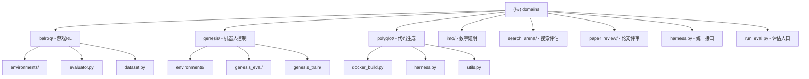

# Domains 模块 - 多领域评估系统

[根目录](../CLAUDE.md) > **domains/**

> **更新时间**: 2026-03-30 11:14:03
>
> **模块类型**: Domain Implementations
>
> **主要语言**: Python 3.12+

---

## 模块职责

Domains 模块包含了 HyperAgents 框架在不同领域的具体实现，每个领域都是一个独立的评估环境：

- **Balrog**: 游戏强化学习环境（NetHack、MiniHack、BabyAI、Crafter、TextWorld）
- **Genesis**: 机器人控制仿真（Go2 步态控制）
- **Polyglot**: 代码生成基准测试
- **IMO**: 数学奥林匹克问题证明与评分
- **Search Arena**: 搜索能力评估
- **Paper Review**: 论文评审能力

每个领域实现了统一的评估接口，支持相同的遗传循环改进流程。

---

## 模块结构图



---

## 统一接口

### 领域评估接口 (harness.py)

所有领域都通过 `domains/harness.py` 提供统一的评估接口：

```python
# 运行领域评估
python -m domains.harness \
    --domain <domain_name> \
    --run_id <run_id> \
    --num_samples <num_samples> \
    --num_workers <num_workers>
```

**支持的领域**:
- `balrog_*`: Balrog 游戏系列
  - `balrog_minihack`
  - `balrog_babaisai`
  - `balrog_babyai_text`
  - `balrog_crafter`
  - `balrog_nle`
  - `balrog_textworld`
- `genesis_*`: Genesis 机器人系列
  - `genesis_go2walking`
  - `genesis_go2hopping`
- `polyglot`: 代码生成
- `imo_proof`: 数学证明生成
- `imo_grading`: 数学证明评分
- `search_arena`: 搜索评估
- `paper_review`: 论文评审

### 领域报告接口 (report.py)

```python
# 生成评估报告
python -m domains.report \
    --domain <domain_name> \
    --dname ./outputs/<run_id>
```

---

## 领域特征对比

| 领域 | 类型 | 评估指标 | 数据集 | 并行支持 | Docker需求 |
|-----|------|---------|--------|---------|-----------|
| **Balrog** | 强化学习 | `average_progress` | 游戏环境 | ✅ 是 | ❌ 否 |
| **Genesis** | 强化学习 | `average_fitness` | 仿真环境 | ✅ 是 | ❌ 否 |
| **Polyglot** | 代码生成 | `accuracy_score` | 代码库 | ❌ 否 | ✅ 是 |
| **IMO Proof** | 数学推理 | `points_percentage` | IMO题目 | ❌ 否 | ❌ 否 |
| **IMO Grading** | 评分 | `overall_accuracy` | 证明评分 | ❌ 否 | ❌ 否 |
| **Search Arena** | 搜索 | `overall_accuracy` | 搜索查询 | ❌ 否 | ❌ 否 |
| **Paper Review** | 评审 | `overall_accuracy` | 论文数据集 | ❌ 否 | ❌ 否 |

---

## 领域工具函数

### utils/domain_utils.py

```python
# 获取领域评分键
def get_domain_score_key(domain):
    """返回领域的主要评分指标名称"""

# 获取领域数据划分
def get_domain_splits(domain, eval_test=False):
    """返回领域的数据集划分（train/val/test）"""

# 检查是否支持集成
def can_domain_ensembled(domain):
    """返回领域是否支持多智能体集成"""

# 获取评估子集
def get_domain_eval_subset(domain):
    """返回领域的评估子集标识"""
```

---

## 运行示例

### Balrog 游戏评估

```bash
# MiniHack 评估
python -m domains.harness \
    --domain balrog_minihack \
    --run_id test_balrog \
    --num_samples 10 \
    --num_workers 4

# 生成报告
python -m domains.report \
    --domain balrog_minihack \
    --dname ./outputs/test_balrog
```

### Genesis 机器人评估

```bash
# Go2 步态控制
python -m domains.harness \
    --domain genesis_go2walking \
    --run_id test_genesis \
    --num_samples 5 \
    --num_workers 1

# 生成报告
python -m domains.report \
    --domain genesis_go2walking \
    --dname ./outputs/test_genesis
```

### Polyglot 代码生成

```bash
# 运行代码生成评估
python -m domains.polyglot.run_evaluation \
    --subset small \
    --num_samples 10

# 或通过 harness
python -m domains.harness \
    --domain polyglot \
    --run_id test_polyglot \
    --num_samples 10
```

---

## 输出结构

### 标准输出目录

```
outputs/
├── {run_id}/
│   ├── eval.log                    # 评估日志
│   ├── archive.json                # 进化档案
│   ├── chat_history.md             # Meta智能体对话
│   ├── {domain_name}/              # 领域特定目录
│   │   ├── episode_{idx}/          # 单个episode结果
│   │   │   ├── chat_history.md     # Task智能体对话
│   │   │   ├── prediction.json     # 预测结果
│   │   │   └── metrics.json        # 评估指标
```

### Balrog 特定输出

```
{domain_name}/
├── episode_{idx}/
│   ├── chat_history.md
│   ├── seed_{seed}/                # 多种子评估
│   │   ├── progress.json           # 游戏进度
│   │   └── trajectory.json         # 轨迹数据
```

### Genesis 特定输出

```
genesis_go2walking/
├── episode_{idx}/
│   ├── chat_history.md
│   ├── rl_eval_{episode_idx}/      # RL评估结果
│   │   ├── eval_log.json
│   │   └── eval_100.mp4            # 评估视频
│   └── rl_train_{episode_idx}/     # RL训练结果
│       ├── model_100.pt            # 模型检查点
│       └── train_log.json
```

### Polyglot 特定输出

```
polyglot/
├── episode_{idx}/
│   ├── chat_history.md
│   ├── prediction.json             # 生成的代码
│   ├── test_results.json           # 测试结果
│   └── diff.patch                  # 代码差异
```

---

## 配置管理

### Balrog 配置

**domains/balrog/config/config.yaml**:
```yaml
defaults:
  - balrog_task: minihack

balrog_task:
  name: minihack
  environment:
    id: MiniHack-CorridorBattle-v0
```

### Genesis 配置

**domains/genesis/config/config.yaml**:
```yaml
defaults:
  - genesis_task: go2walking

genesis_task:
  name: go2walking
  environment:
    id: Go2WalkingCommand-v0
  training:
    num_epochs: 100
    learning_rate: 0.001
```

---

## 测试与质量

### 评估质量保证

1. **多环境测试**: Balrog/Genesis 支持多种环境
2. **多种子评估**: 确保结果稳定性
3. **并行执行**: 加速评估流程
4. **错误恢复**: 失败的episode不会中断整体评估

### 数据集管理

- **训练集**: 用于智能体改进
- **验证集**: 用于选择父代
- **测试集**: 用于最终评估（部分领域）

---

## 常见问题 (FAQ)

### Q1: 如何添加新领域？

**A**: 步骤：

1. 在 `domains/` 下创建新目录
2. 实现 `eval.py`, `evaluator.py`
3. 在 `utils/domain_utils.py` 中注册
4. 更新 `domains/harness.py`
5. 添加配置文件（如需要）

### Q2: 如何调整评估样本数？

**A**: 使用 `--num_samples` 参数：

```bash
python -m domains.harness \
    --domain balrog_minihack \
    --num_samples 100  # 评估100个样本
```

### Q3: 如何并行化评估？

**A**: 使用 `--num_workers` 参数：

```bash
python -m domains.harness \
    --domain balrog_minihack \
    --num_workers 8  # 使用8个并行worker
```

**注意**: Polyglot 不支持并行（每个任务需要独立容器）

### Q4: 如何查看评估进度？

**A**: 检查日志文件：

```bash
# 实时查看评估日志
tail -f outputs/{run_id}/eval.log

# 查看特定episode的对话
cat outputs/{run_id}/{domain}/episode_0/chat_history.md
```

---

## 相关文件清单

### 核心文件
- `domains/harness.py` - 统一评估接口
- `domains/report.py` - 报告生成
- `domains/run_eval.py` - 评估入口
- `utils/domain_utils.py` - 领域工具函数

### 领域模块
- `domains/balrog/` - 游戏RL环境
- `domains/genesis/` - 机器人控制
- `domains/polyglot/` - 代码生成
- `domains/imo/` - 数学证明
- `domains/search_arena/` - 搜索评估
- `domains/paper_review/` - 论文评审

---

## 变更记录 (Changelog)

### 2026-03-30 - 初始化文档
- ✅ 创建 domains 根级文档
- ✅ 记录统一接口和工具函数
- ✅ 对比各领域特征
- 📝 待完善：各领域详细文档
- 📝 待添加：新领域开发指南

---

*此模块文档由 PAI Architecture Agent 自动生成*
