# Utils 模块 - 通用工具库

[根目录](../CLAUDE.md) > **utils/**

> **更新时间**: 2026-03-30 11:34:52
>
> **模块类型**: Common Utilities
>
> **主要语言**: Python 3.12+

---

## 模块职责

Utils 模块提供了 HyperAgents 框架的核心工具函数，支持 Docker 容器管理、Git 操作、领域配置、遗传循环逻辑等关键功能。这些工具被整个框架广泛使用，确保了代码的模块化和可维护性。

**核心功能**：
- Docker 容器构建和管理（支持 GPU）
- Git 仓库操作和差异管理
- 领域配置和数据划分
- 遗传循环状态管理
- 线程安全的日志记录
- 集成和父代选择

---

## 模块结构图

```mermaid
graph TD
    A["(根) utils"] --> B["docker_utils.py"];
    A --> C["git_utils.py"];
    A --> D["domain_utils.py"];
    A --> E["gl_utils.py"];
    A --> F["common.py"];
    A --> G["constants.py"];
    A --> H["thread_logger.py"];
    A --> I["run_ensemble.py"];
    A --> J["run_select_next_parent.py"];

    B --> B1["build_container()"];
    B --> B2["copy_to_container()"];
    B --> B3["copy_from_container()"];
    B --> B4["verify_gpu_in_container()"];

    C --> C1["commit_repo()"];
    C --> C2["diff_versus_commit()"];
    C --> C3["apply_patch()"];

    D --> D1["get_domain_score_key()"];
    D --> D2["get_domain_splits()"];
    D --> D3["can_domain_ensembled()"];

    E --> E1["setup_initial_gen()"];
    E --> E2["select_parent()"];
    E --> E3["apply_diffs_container()"];

    F --> F1["read_file()"];
    F --> F2["write_file()"];

    H --> H1["ThreadLoggerManager"];
```



---

## 子模块详解

### 1. Docker 工具 (`docker_utils.py`)

**职责**: Docker 容器构建、管理和文件操作

**核心功能**:
- 构建容器镜像（支持代理和 GPU）
- 运行和管理容器
- 文件复制（主机 ↔ 容器）
- GPU 可用性验证
- 容器清理

**关键函数**:

```python
def build_container(
    client,
    repo_path="./",
    image_name="app",
    container_name="app-container",
    force_rebuild=False,
    domains=None,
    verbose=True
):
    """
    构建 Docker 容器（支持 GPU）

    Args:
        client: Docker 客户端
        repo_path: 仓库路径
        image_name: 镜像名称
        container_name: 容器名称
        force_rebuild: 强制重新构建
        domains: 领域列表（用于判断是否需要 GPU）
        verbose: 是否输出日志

    Returns:
        Container: Docker 容器对象
    """

def copy_to_container(
    container,
    source_path,
    dest_path,
    verbose=True
):
    """
    复制文件/目录到容器

    Args:
        container: 容器对象
        source_path: 源路径（主机）
        dest_path: 目标路径（容器）
    """

def copy_from_container(
    container,
    source_path,
    dest_path,
    verbose=True
):
    """
    从容器复制文件/目录

    Args:
        container: 容器对象
        source_path: 源路径（容器）
        dest_path: 目标路径（主机）
    """

def verify_gpu_in_container(container, verbose=True) -> bool:
    """
    验证容器内 GPU 可用性

    Args:
        container: 容器对象
        verbose: 是否输出日志

    Returns:
        bool: GPU 是否可用
    """
```

**GPU 支持**:
- 自动检测 nvidia-docker 运行时
- 支持 Podman（通过 CDI 设备接口）
- 自动挂载 GPU 设备
- 验证 Genesis 和 PyTorch GPU 访问

---

### 2. Git 工具 (`git_utils.py`)

**职责**: Git 仓库操作和版本控制

**核心功能**:
- 提交更改
- 获取差异
- 应用补丁
- 重置到指定提交

**关键函数**:

```python
def commit_repo(repo_path, message="Auto commit"):
    """
    提交仓库更改

    Args:
        repo_path: 仓库路径
        message: 提交信息

    Returns:
        str: 提交哈希
    """

def diff_versus_commit(repo_path, commit_hash):
    """
    获取相对于指定提交的差异

    Args:
        repo_path: 仓库路径
        commit_hash: 基准提交哈希

    Returns:
        str: 差异内容
    """

def apply_patch(repo_path, patch_file):
    """
    应用补丁文件

    Args:
        repo_path: 仓库路径
        patch_file: 补丁文件路径
    """

def reset_to_commit(repo_path, commit_hash, hard=False):
    """
    重置到指定提交

    Args:
        repo_path: 仓库路径
        commit_hash: 目标提交哈希
        hard: 是否使用 --hard 重置
    """

def reset_paths_to_commit(repo_path, commit, paths):
    """
    重置指定路径到提交

    Args:
        repo_path: 仓库路径
        commit: 目标提交
        paths: 要重置的路径列表
    """
```

---

### 3. 领域工具 (`domain_utils.py`)

**职责**: 领域配置和数据管理

**核心功能**:
- 获取领域评分键
- 获取数据划分
- 检查集成支持
- 获取评估子集

**关键函数**:

```python
def get_domain_score_key(domain):
    """
    获取领域的主要评分指标名称

    Args:
        domain: 领域名称

    Returns:
        str: 评分键名（如 "average_progress", "accuracy_score"）
    """

def get_domain_splits(domain, eval_test=False):
    """
    获取领域的数据集划分

    Args:
        domain: 领域名称
        eval_test: 是否包含测试集

    Returns:
        list: 数据划分列表（如 ["train", "val", "test"]）
    """

def can_domain_ensembled(domain):
    """
    检查领域是否支持集成

    Args:
        domain: 领域名称

    Returns:
        bool: 是否支持集成
    """

def get_domain_eval_subset(domain):
    """
    获取领域的评估子集标识

    Args:
        domain: 领域名称

    Returns:
        str: 子集标识（如 "_filtered_100"）
    """

def get_domain_stagedeval_frac(domain):
    """
    获取分阶段评估比例

    Args:
        domain: 领域名称

    Returns:
        float: 评估比例（0.0-1.0）
    """
```

**领域配置映射**:

| 领域 | 评分键 | 数据划分 | 支持集成 | 评估子集 |
|-----|--------|---------|---------|---------|
| `balrog_*` | `average_progress` | `["train"]` | ❌ | `""` |
| `genesis_*` | `average_fitness` | `["train"]` | ❌ | `""` |
| `polyglot` | `accuracy_score` | `["train", "test"]` | ❌ | `"_small"` |
| `imo_proof` | `points_percentage` | `["train", "val", "test"]` | ✅ | `""` |
| `search_arena` | `overall_accuracy` | `["train", "val", "test"]` | ✅ | `"_filtered_100"` |
| `paper_review` | `overall_accuracy` | `["train", "val", "test"]` | ✅ | `"_filtered_100"` |

---

### 4. 遗传循环工具 (`gl_utils.py`)

**职责**: 遗传循环状态管理和父代选择

**核心功能**:
- 设置初始代
- 选择父代智能体
- 应用差异
- 档案管理
- 得分获取

**关键函数**:

```python
def setup_initial_gen(
    output_dir,
    domains,
    copy_root_dir=None,
    subsets=[],
    resume=False,
    copy_eval=True,
    optimize_option="only_agent",
    run_baseline=None,
    eval_test=False,
    edit_select_parent=False
):
    """
    设置初始代智能体

    Args:
        output_dir: 输出目录
        domains: 领域列表
        copy_root_dir: 复制根目录（可选）
        subsets: 数据子集列表
        resume: 是否恢复之前运行
        copy_eval: 是否复制评估结果
        optimize_option: 优化选项
        run_baseline: 运行基线
        eval_test: 是否评估测试集
        edit_select_parent: 是否编辑父代选择

    Returns:
        tuple: (root_dir, commit_hash)
    """

def select_parent(archive, output_dir, domains, method="best"):
    """
    从档案中选择父代

    Args:
        archive: 档案列表
        output_dir: 输出目录
        domains: 领域列表
        method: 选择方法
            - "random": 随机选择
            - "latest": 选择最新
            - "best": 选择最佳
            - "score_prop": 按得分比例选择
            - "score_child_prop": 按得分和子代数比例选择

    Returns:
        int/str: 父代 genid
    """

def apply_diffs_container(
    container,
    patch_files,
    repo_name=REPO_NAME,
    verbose=True
):
    """
    在容器内应用差异

    Args:
        container: 容器对象
        patch_files: 补丁文件列表
        repo_name: 仓库名称
        verbose: 是否输出日志

    Returns:
        str: 新的提交哈希
    """

def get_saved_score(
    domain,
    output_dir,
    genid,
    split="train",
    type="agent"
):
    """
    获取保存的评分

    Args:
        domain: 领域名称
        output_dir: 输出目录
        genid: 代 ID
        split: 数据划分
        type: 评分类型（agent/ensemble/max）

    Returns:
        float/None: 评分（None 表示无效）
    """

def load_archive_data(filepath, last_only=True):
    """
    加载档案数据

    Args:
        filepath: 档案文件路径
        last_only: 是否仅返回最后一条

    Returns:
        dict/list: 档案数据
    """
```

**父代选择方法**:

1. **random**: 完全随机选择
2. **latest**: 选择最新生成的智能体
3. **best**: 选择得分最高的智能体
4. **score_prop**: 按得分比例随机选择（高分更可能）
5. **score_child_prop**: 按得分和子代数比例选择（鼓励多样性）

---

### 5. 通用工具 (`common.py`)

**职责**: 通用文件和字符串操作

**关键函数**:

```python
def read_file(file_path):
    """读取文件内容"""

def write_file(file_path, content):
    """写入文件内容"""

def ensure_dir(dir_path):
    """确保目录存在"""

def get_timestamp():
    """获取当前时间戳"""
```

---

### 6. 常量 (`constants.py`)

**职责**: 全局常量定义

**关键常量**:

```python
REPO_NAME = "HyperAgents"  # 仓库名称
```

---

### 7. 线程日志 (`thread_logger.py`)

**职责**: 线程安全的日志记录

**核心类**:

```python
class ThreadLoggerManager:
    """
    线程安全的日志管理器

    支持多线程环境下的独立日志记录
    """

    def __init__(self, log_file):
        """
        初始化日志管理器

        Args:
            log_file: 日志文件路径
        """

    def get_logger(self):
        """获取当前线程的日志记录器"""

    def log(self, message, level=logging.INFO):
        """记录日志"""
```

---

### 8. 集成运行 (`run_ensemble.py`)

**职责**: 运行集成评估

**入口点**:
```python
if __name__ == "__main__":
    # 从命令行参数获取配置
    # 运行集成评估
    # 保存结果到 report_ensemble_{domain}_{split}.json
```

---

### 9. 父代选择运行 (`run_select_next_parent.py`)

**职责**: 运行自定义父代选择

**入口点**:
```python
if __name__ == "__main__":
    # 从命令行参数获取配置
    # 运行父代选择
    # 返回选中的父代 genid
```

---

## 关键依赖与配置

### 依赖项

```python
# requirements.txt
docker>=6.0.0
GitPython>=3.1.0
pandas>=1.3.0
numpy>=1.21.0
```

### 系统依赖

```bash
# Docker/Podman
docker --version
# 或
podman --version

# Git
git --version
```

---

## 数据模型

### metadata.json 格式

```json
{
  "parent_genid": 2,
  "valid_parent": true,
  "can_select_next_parent": true,
  "run_full_eval": false,
  "prev_patch_files": ["meta_patch_files/model_patch_0.diff"],
  "curr_patch_files": ["meta_patch_files/model_patch_1.diff"]
}
```

### archive.jsonl 格式

```json
{
  "current_genid": 5,
  "archive": [0, 1, 2, 3, 4, 5]
}
```

---

## 测试与质量

### 测试脚本

```bash
# 测试 Docker 构建
python -c "from utils.docker_utils import build_container; ..."

# 测试 Git 操作
python -c "from utils.git_utils import commit_repo; ..."

# 测试领域工具
python -c "from utils.domain_utils import get_domain_score_key; ..."
```

### 质量保证

1. **线程安全**: 所有日志操作使用线程局部存储
2. **错误处理**: 关键操作有异常捕获和重试
3. **日志记录**: 详细日志用于调试和监控

---

## 常见问题 (FAQ)

### Q1: 如何在 Podman 上使用 GPU？

**A**: 确保安装 Podman 5.x+ 并配置 CDI：

```bash
# 安装 nvidia-container-toolkit
sudo dnf install nvidia-container-toolkit

# 生成 CDI 配置
nvidia-ctk cdi generate --output=/etc/cdi/nvidia.yaml

# 验证
podman run --rm --device nvidia.com/gpu=all nvidia/cuda:11.8.0-base-ubuntu22.04 nvidia-smi
```

### Q2: 如何调试容器内问题？

**A**: 使用交互式容器：

```python
# 修改 build_container 中的 command
command = "tail -f /dev/null"  # 保持容器运行

# 进入容器
docker exec -it app-container bash
# 或
podman exec -it app-container bash
```

### Q3: 如何自定义父代选择策略？

**A**: 编辑 `run_select_next_parent.py`：

```python
def select_next_parent(archive, output_dir, domains):
    # 实现自定义选择逻辑
    # 返回选中的 genid
    return selected_genid
```

### Q4: 如何添加新领域配置？

**A**: 修改 `domain_utils.py`：

```python
def get_domain_score_key(domain):
    # 添加新领域
    if "new_domain" in domain:
        return "new_score_key"
    ...
```

---

## 相关文件清单

### 核心工具
- `utils/docker_utils.py` - Docker 容器管理
- `utils/git_utils.py` - Git 操作
- `utils/domain_utils.py` - 领域配置
- `utils/gl_utils.py` - 遗传循环逻辑

### 辅助工具
- `utils/common.py` - 通用函数
- `utils/constants.py` - 全局常量
- `utils/thread_logger.py` - 线程日志

### 运行脚本
- `utils/run_ensemble.py` - 集成评估
- `utils/run_select_next_parent.py` - 父代选择

---

## 变更记录 (Changelog)

### 2026-03-30 - 初始化文档
- ✅ 创建 utils 模块文档
- ✅ 记录所有工具函数
- ✅ 记录使用示例和接口
- 📝 待添加：更多错误处理
- 📝 待添加：单元测试

---

*此模块文档由 PAI Architecture Agent 自动生成*
